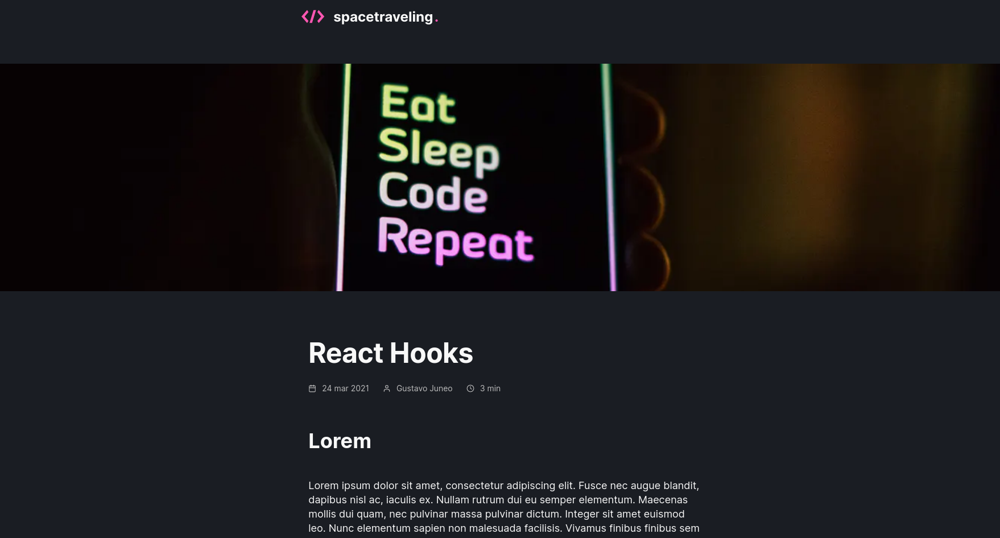

<div align="center">
  
</div>

<br />
<p align="center">
  <a href="#the-solution">Solution</a>&nbsp;&nbsp;&nbsp;|&nbsp;&nbsp;&nbsp;
  <a href="#technologies">Technologies</a>&nbsp;&nbsp;&nbsp;|&nbsp;&nbsp;&nbsp;
  <a href="how-to-use">How to use</a>&nbsp;&nbsp;&nbsp;|&nbsp;&nbsp;&nbsp;
  <a href="#license">License</a>
</p>

## The Solution

<div align="center">
  
</div>

Challenge of Chapter 3 of the Ignite bootcamp (ReactJS) from [Rocketseat](http://rocketseat.com.br/), developing a blog with the Prismic CMS.

You can view the project accessing the following link https://spacetraveling.vercel.app.

## Technologies
- [TypeScript](https://www.typescriptlang.org/)
- [ReactJS](http://reactjs.org/)
- [Next.js](https://nextjs.org/)
- [Prismic CMS](https://prismic.io/)
- [date-fns](https://date-fns.org/)
- [React Icons](https://react-icons.github.io/react-icons/)
- [Sass](https://sass-lang.com/)
- [Jest](https://jestjs.io/)
- [ESLint](https://eslint.org/)
- [Prettier](https://prettier.io/)
- [Yarn](https://yarnpkg.com/)

## How to use

### Required Environment Variables

- PRISMIC_ENDPOINT
- PRISMIC_ACCESS_TOKEN

### Repository clone
To download the project on your machine, run the command below in the terminal or [download](https://github.com/gustavojuneo/spacetraveling/archive/main.zip).

```bash
$ git clone https://github.com/gustavojuneo/spacetraveling/.git
```

### Installing the Dependencies

To be able to start the application it will be necessary to install the project dependencies, run the command below in the directory to install all the necessary dependencies.

```bash
$ yarn install
```
ou

if you don't use Yarn you can use npm, just remove the yarn.lock file from inside the folder and run the following command:
```bash
$ npm install
```
### Starting the Application

To start the application use the command:

```bash
$ yarn dev
```

The application will run by default on the route:
https://localhost:3000
